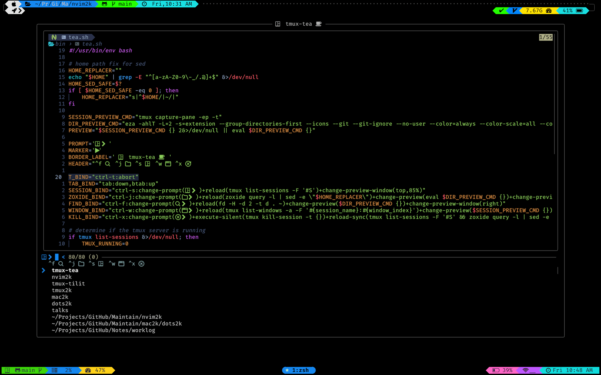

<div align = "center">

<h1><a href="https://github.com/2kabhishek/tmux-tea">tmux-tea</a></h1>

<a href="https://github.com/2KAbhishek/tmux-tea/blob/main/LICENSE">
 </a>

<a href="https://github.com/2KAbhishek/tmux-tea/graphs/contributors">
 </a>

<a href="https://github.com/2KAbhishek/tmux-tea/stargazers">
</a>

<a href="https://github.com/2KAbhishek/tmux-tea/network/members">
 </a>

<a href="https://github.com/2KAbhishek/tmux-tea/watchers">
 </a>

<a href="https://github.com/2KAbhishek/tmux-tea/pulse">
 </a>

<h3>tmux sessions as easy as tea ☕🪟</h3>

<figure>
  
  <br/>
  <figcaption>tmux-tea in action</figcaption>
</figure>

</div>

tmux-tea is a tmux session manager aimed at simplifying and speeding up how you interact with tmux sessions.
It's a one key solution to all your tmux session needs.

## ✨ Features

-   Integrations with tmuxinator for session specific configs
-   Integrations with fzf for fuzzy search
-   Supports session previews
-   Integrations with zoxide for directory based session creation

## Setup

### ⚡ Requirements

-   tmux, fzf, zoxide (required)
-   tmuxinator (for session layouts)
-   eza (for directory previews)

### 🚀 Installation

Add the following to your `~/.tmux.conf`

```bash
set -g @plugin '2kabhishek/tmux-tea'
```

```bash
cd ~/.tmux/plugins/tmux-tea # replace ~/.tmux/plugins with your plugin installation path
ln -sfnv $PWD/bin/tea.sh  ~/.local/bin/tea # Add tea to $PATH, make sure ~/.local/bin is in your $PATH
```

### 💻 Usage

There are two ways to open tea

- `<prefix> - t`, this can be configured with the `@tea-bind` option
- <kbd>Ctrl</kbd>+<kbd>t</kbd> alternate binding for a smoother experience.

#### Keybindings

- <kbd>Ctrl</kbd>+<kbd>f</kbd> - Directory mode
- <kbd>Ctrl</kbd>+<kbd>j</kbd> - Zoxide mode
- <kbd>Ctrl</kbd>+<kbd>s</kbd> - Session mode
- <kbd>Ctrl</kbd>+<kbd>w</kbd> - Window mode
- <kbd>Ctrl</kbd>+<kbd>x</kbd> - Kill mode
- <kbd>Ctrl</kbd>+<kbd>t</kbd> - Toggle tea

#### tmuxinator integration

If you have a `.tmuxinator.yml` file in your directory, tea will use it for setting up your session.

If you have a tmuxinator config file in `~/.config/tmuxinator/` that has the same name as your tmux session directory then that will be used.

If none of these are present a tmux session is created from scratch.

#### zsh integration

If you use zsh you can add the `<C-t>` binding outside tmux as well using this sni[[ed]]

```bash
bindkey -s '^T' ' tea^M ^M'
```

#### full session names

You can set the session name to be the full path you select instead of the directory using:

```tmux
set -g @tea-session-name "full-path"
```

## Behind The Code

### 🌈 Inspiration

tmux-tea was inspired by [t-smart-tmux-session-manager](https://github.com/joshmedeski/t-smart-tmux-session-manager) and shares a lot of code.

I wanted to add some more features that diverged from the original repo and wanted to keep the configs simpler.

### 💡 Challenges/Learnings

-   Figuring out the preview script was quite tricky.
-   Bash shenanigans!

### 🧰 Tooling

-   [dots2k](https://github.com/2kabhishek/dots2k) — Dev Environment
-   [nvim2k](https://github.com/2kabhishek/nvim2k) — Personalized Editor
-   [sway2k](https://github.com/2kabhishek/sway2k) — Desktop Environment
-   [qute2k](https://github.com/2kabhishek/qute2k) — Personalized Browser

### 🔍 More Info

-   [tmux-tilit](https://github.com/2kabhishek/tmux-tilit) — Turns tmux into a terminal window manager
-   [tmux2k](https://github.com/2kabhishek/tmux2k) — Makes your tmux statusbar pretty!

<hr>

<div align="center">

<strong>⭐ hit the star button if you found this useful ⭐</strong><br>

<a href="https://github.com/2KAbhishek/tmux-tea">Source</a>
| <a href="https://2kabhishek.github.io/blog" target="_blank">Blog </a>
| <a href="https://twitter.com/2kabhishek" target="_blank">Twitter </a>
| <a href="https://linkedin.com/in/2kabhishek" target="_blank">LinkedIn </a>
| <a href="https://2kabhishek.github.io/links" target="_blank">More Links </a>
| <a href="https://2kabhishek.github.io/projects" target="_blank">Other Projects </a>

</div>
