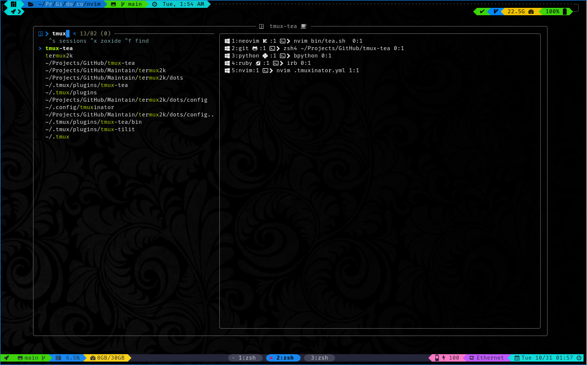

<div align = "center">

<h1><a href="https://github.com/2kabhishek/tmux-tea">tmux-tea</a></h1>

<a href="https://github.com/2KAbhishek/tmux-tea/blob/main/LICENSE">
 </a>

<a href="https://github.com/2KAbhishek/tmux-tea/graphs/contributors">
 </a>

<a href="https://github.com/2KAbhishek/tmux-tea/stargazers">
</a>

<a href="https://github.com/2KAbhishek/tmux-tea/network/members">
 </a>

<a href="https://github.com/2KAbhishek/tmux-tea/watchers">
 </a>

<a href="https://github.com/2KAbhishek/tmux-tea/pulse">
 </a>

<h3>tmux sessions as easy as tea ☕🪟</h3>

<figure>
  
  <br/>
  <figcaption>tmux-tea in action</figcaption>
</figure>

</div>

tmux-tea is a tmux session manager aimed at simplifying and speeding up how you interact with tmux sessions.
It's a one key solution to all your tmux session needs.

## ✨ Features

- Integrations with tmuxinator for specific session configs
- Integrations with fzf and zoxide for fuzzy session and dir navigation
- Supports session previews

## Setup

### ⚡ Requirements

- tmux, fzf, zoxide (required)
- tmuxinator (recommended)

### 🚀 Installation

Add the following to your `~/.tmux.conf`

```bash
set -g @plugin '2kabhishek/tmux-tea'
```

```bash
cd ~/.tmux/plugins/tmux-tea # replace ~/.tmux/plugins with your plugin installation path
ln -sfnv $PWD/bin/tea.sh  ~/.local/bin/t
```

### 💻 Usage

```bash
USAGE:
    tmux-tea [FLAGS] [OPTIONS]
Example:
    tmux-tea
```

## What's Next

Planning to add `<feature/module>`.

### ✅ To-Do

- [x] Setup repo
- [ ] Think real hard
- [ ] Start typing

##  Behind The Code

### 🌈 Inspiration

tmux-tea was inspired by `<reason/idea>`.

### 💡 Challenges/Learnings

- The main challenges were `<issue/difficulty>`
- I learned about `<learning/accomplishment>`

### 🧰 Tooling

- [dots2k](https://github.com/2kabhishek/dots2k) — Dev Environment
- [nvim2k](https://github.com/2kabhishek/nvim2k) — Personalized Editor

### 🔍 More Info

- [similar](https://github.com/2kabhishek/similar) — a related repo

<hr>

<div align="center">

<strong>⭐ hit the star button if you found this useful ⭐</strong><br>

<a href="https://github.com/2KAbhishek/tmux-tea">Source</a>
| <a href="https://2kabhishek.github.io/blog" target="_blank">Blog </a>
| <a href="https://twitter.com/2kabhishek" target="_blank">Twitter </a>
| <a href="https://linkedin.com/in/2kabhishek" target="_blank">LinkedIn </a>
| <a href="https://2kabhishek.github.io/links" target="_blank">More Links </a>
| <a href="https://2kabhishek.github.io/projects" target="_blank">Other Projects </a>

</div>

